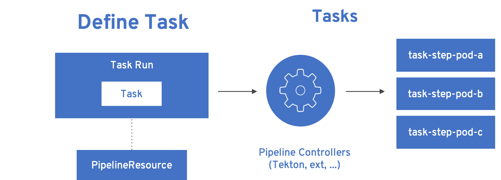

Historically Java was able to handle the biggest enterprise problem(s)
with its Write once,run anywhere(WORA) paradigm. With Cloud Native
Applications grown to popularity, things like running applications as
linux containers, serverless taking centre stage — Java was pushed back
by languages like golang, node.js as the forerunner to build Cloud
Native Applications as they are smaller, quicker and arguably more
nimble.

When analyzing what could be the possible reasons why developers were
reluctant in building Kubernetes(Cloud) Native Java applications, I
ended up the with the following possible reasons:

1.  Java applications are slow to boot

2.  What is the best way to build Java application container (a
    container here is the linux container that can run Java application)
    ?

3.  The last point which is the subject of this article
    "pipelines" — with traditional Java Enterprise world got used to
    pipelines via platform like Jenkins, Bamboo etc., which made them
    think what is the best way to do it for Cloud Native Java
    applications — 

I am not going to over on first two points, as they are super easy by
just using [Quarkus](https://quarkus.io) and enterprise
[Kubernetes](https://kubernetes.io) distribution like
[OpenShift](https://openshift.com).

So what about pipelines ? But first question that comes to your mind is
"Why cant I use the existing tools ?" Yes of course you can, but
thinking about factors such as running it as containers, scale on demand
and lastly fitting into the DevOps culture.

The simple solution to these issues is using
[Tekton](https://tekton.dev). Tekton was built keeping in mind:

-   Containers - Built for container apps and runs on Kubernetes

-   Serverless - Runs serverless with no CI/CD engine to manage and
    maintain

-   DevOps - Designed with microserviecs and distributed teams in mind

Install Tekton Pipelines
========================

Pre-req
-------

-   A [Kubernetes
    cluster](https://kubernetes.io/docs/setup/learning-environment/minikube/)
    or try.openshift.com\[OpenShift\] with [Tekton](https://tekton.dev)
    installed

-   If minikube have the internal container registry deployed; check
    [Registry
    Helpers](https://github.com/kameshsampath/minikube-helpers/tree/master/registry)

-   Download and add [Tekton CLI](https://github.com/tektoncd/cli) to
    the path

Demo Sources
------------

For demonstrating the pipelines we will use a simple Java HelloWorld
application built using [Quarkus](https://quarkus.io), clone the demo
sources locally:

    git clone https://https://github.com/kameshsampath/pipeline-helloworld && \
    cd pipeline-helloworld && \
    export DEMO_HOME=`pwd`

> **Note**
>
> For easier reference we will call the cloned git repository home as
> `$DEMO_HOME`

Tekton Concepts
===============

Before we start deploying our demo, it will be nice to know about the
Kubernetes resources or objects that will defined using Tekton.

Everything in Tekton are defined using [Custom
Resources(CRD)](https://kubernetes.io/docs/concepts/extend-kubernetes/api-extension/custom-resources/Kubernetes).
With custom resources Tekton can define anything related to pipelines in
Kubernetes Native way a.k.a Cloud Native way.

Pipeline resources
------------------

Defines referable resources such as source code repo, container images
e.g. GitHub repository, container image url.

Defining the pipeline resources improves **reusability** by making these
resource parameters not local to task and pipelines.

Lets explore pipeline resources defined as part of this
[demo](https://github.com/kameshsampath/pipeline-helloworld)

**[GitHub source repo pipeline
resource](https://github.com/kameshsampath/pipeline-helloworld/blob/master/build-resources.yaml#L1-L11).**

    apiVersion: tekton.dev/v1alpha1
    kind: PipelineResource
    metadata:
      name: git-source 
    spec:
      type: git 
      params: 
      - name: url
        value: https://github.com/kameshsampath/pipeline-helloworld
      - name: revision
        value: master

-   Name of the pipeline resource, which will used to refer them in
    tasks and pipelines

-   The type of the pipeline resource, in this case "git"

-   The parameters for the resource. In this case url to the GitHub
    repository and the revision.

**[Container image pipeline
resource](https://github.com/kameshsampath/pipeline-helloworld/blob/master/build-resources.yaml#L13-L21).**

    apiVersion: tekton.dev/v1alpha1
    kind: PipelineResource
    metadata:
      name: helloworld-image 
    spec:
      type: image 
      params:
      - name: url
        value: "dev.local/example/helloworld" 

-   Name of the pipeline resource, which will used to refer them in
    tasks and pipelines

-   The type of the pipeline resource, in this case "image"

-   The parameters for the resource. In this case container image url.
    This will be url where the container image will be built and pushed
    as part of the task and pipeline

There are few pipeline resource types that are defined during the
install of the Tekton pipelines. Check
[here](https://github.com/tektoncd/pipeline/blob/master/docs/resources.md)
for more details on available pipeline resources.

Tasks
-----

A [Task](https://github.com/tektoncd/pipeline/blob/master/docs/tasks.md)
is the very fundamental unit of Tekton. Task consists of multiple atomic
units called **step**.

Step runs the command inside the container and it identical to the
Kubernetes
[pod](https://kubernetes.io/docs/concepts/workloads/pods/pod/). A task
can have multiple steps, they get executed in the sequential order like
how they were defined.

Lets define the steps for our task to build a Java application container
image from sources:

1.  Build the Java application using build tools like Apache Maven or
    Gradle

2.  Use the built artifacts to make the Java application container image

3.  Push the built Java application container image to internal registry
    or external registry to allow platform like Kubernetes or OpenShift
    to consume them

Lets explore the demo Java build task,

**[Java build app
task](https://github.com/kameshsampath/pipeline-helloworld/blob/master/app-build-task.yaml).**

    apiVersion: tekton.dev/v1alpha1
    kind: Task
    metadata:
      name: build-app 
    spec:
      inputs: 
       resources: 
        - name: source
          type: git
       params: 
       - name: contextDir
         description: Parameter Description
         default: .
       - name: mavenMirrorUrl
         description: Parameter Description
         default: http://repo1.maven.apache.org/maven2
       - name: destinationImage
         description: Parameter Description
         default: "${outputs.resources.builtImage.url}"
       - name: dockerFile
         description: Parameter Description
         default: src/main/docker/Dockerfile.jvm
      outputs: 
       resources:
        - name: builtImage
          type: image
      steps: 
       - name: build-sources
         image: quay.io/rhdevelopers/quarkus-java-builder:graal-19.1.1 
         workingDir: "/workspace/source/${inputs.params.contextDir}"
         args:
          - '/usr/local/bin/maven-run.sh'
         env:
         - name: MAVEN_MIRROR_URL
           value: "${inputs.params.mavenMirrorUrl}"
         - name: MAVEN_CMD_ARGS
           value: "-DskipTests clean install"
         - name: WORK_DIR
           value: "/workspace/source/${inputs.params.contextDir}"
         resources:
           limits:
             cpu: 4
             memory: 4Gi
           requests:
             cpu: 2
             memory: 2Gi
         securityContext:
           privileged: true
       - name: build-image
         image: quay.io/buildah/stable
         workingDir: "/workspace/source/${inputs.params.contextDir}"
         command:
          - buildah
          - bud
          - --tls-verify=false
          - --layers
          - -t
          - "${inputs.params.destinationImage}"
          - -f
          - "${inputs.params.dockerFile}"
          - .
         resources:
           limits:
             cpu: 4
             memory: 4Gi
           requests:
             cpu: 2
             memory: 2Gi
         securityContext:
           privileged: true
         volumeMounts:
         - name: varlibc
           mountPath: /var/lib/containers
       - name: build-push
         image: quay.io/buildah/stable
         workingDir: "/workspace/source/${inputs.params.contextDir}"
         command:
          - buildah
          - push
          - --tls-verify=false
          - "${inputs.params.destinationImage}"
          - "docker://${inputs.params.destinationImage}"
         securityContext:
           privileged: true
         volumeMounts:
         - name: varlibc
           mountPath: /var/lib/containers
      volumes:
      - name: varlibc
        emptyDir: {}

-   Name of the task, which will be used to refer to this task in other
    places such as task run, pipeline runs

-   Each task has an optional input

-   Input can have resources, typically the sources to build from. The
    task here defines a source of type to `Git` i.e. a GitHub source
    repository to clone sources

-   Inputs can also have zero or more parameters that can be used in
    task steps

-   Task can define an optional output, in our case this task will build
    a Java application container image from sources

-   The steps actually define task’s steps. In our case we have three
    steps namely:

    -   `build-sources`: Runs a maven build to build the application
        sources

    -   `build-image`: Runs a [buildah](https://buildah.io) build to
        build the application container image from built java
        application artifacts

    -   `build-image`: Pushes the built container image to internal or
        external container registry

The step follows the Kubernetes [pod
specification](https://kubernetes.io/docs/reference/generated/kubernetes-api/v1.13/#pod-v1-core)
to define itself. This essentially means each step runs the command with
in a **container**. The container image used in step container is called
as `builder image`.

All steps share a common directory called `workspace` that gets
automatically mounted on all step containers of the task.

The task parameters could be referred/interpolated within the step
specificaiton using the `${<name>}`. notation.

TaskRuns
--------

[TaskRun](https://github.com/tektoncd/pipeline/blob/master/docs/taskruns.md)
allows to run an individual task. The task run allows us to pass the
inputs(sources,parameters) and ouput references to the task. The
references are usually defined via pipeline resources.

While defined the tasks we defined an
[input](https://github.com/kameshsampath/pipeline-helloworld/blob/master/app-build-task.yaml#L8),
[output](https://github.com/kameshsampath/pipeline-helloworld/blob/master/app-build-task.yaml#L25)
and bunch of
[parameters](https://github.com/kameshsampath/pipeline-helloworld/blob/master/app-build-task.yaml#L11-L22).
The names of these will act as an handle for us to pass the
inputs/ouputs to the task from task run.

Lets see how we do it in the demo,

**[Java build app task
run](https://github.com/kameshsampath/pipeline-helloworld/blob/master/app-build-task-run.yaml).**

    apiVersion: tekton.dev/v1alpha1
    kind: TaskRun
    metadata:
      generateName: build-app- 
    spec:
      serviceAccount: pipeline
      taskRef:
        name:  build-app 
      inputs:
       resources:
        - name: source 
          resourceRef:
            name: git-source
       params:
        - name: contextDir 
          value: app
        # Enable if you have maven mirrors to use
        # - name: mavenMirrorUrl
        #   value: http://nexus:8081/nexus/content/groups/public
      outputs:
       resources:
        - name: builtImage 
          resourceRef:
            name: helloworld-image

-   Since tasks can be run many times, its ideal to have unique names
    for each run. In his case each task run will have a name
    `build-app-<uuid>`

-   `taskRef` is used to define the task that this task run will
    execute. In this case we use the task we defined earlier `build-app`

-   Using the inputs → resources, we link the task input resource named
    `source` with pipeline resource named `git-source`

-   Set the task parameter named `contextDir`

-   Using the outputs → resources, we link the task output resource
    named `builtImage` with pipeline resource named `helloworld-image`

Deploy Demo
===========

Having defined all the required resources that is needed to build the
Java application, let us build and deploy the application on to
Kubernetes. Before we go further its assumed that [pipelines
installation](#install) was done successfully.

Create a Service Account with cluster-admin privileges
------------------------------------------------------

    cd $DEMO_HOME &&\
    kubectl create sa pipeline && \
    kubectl create clusterrolebinding pipeline-cluster-admin-binding --clusterrole=cluster-admin --serviceaccount=default:pipeline

Create Pipeline Resources
-------------------------

    kubectl create -f build-resources.yaml

Since we have installed Tekton cli, we can verify the created resources
using the command:

    tkn resources ls

> **Tip**
>
> You can also the short-name for the resources `res` e.g `tkn res ls`

The command above will return a list like

    NAME               TYPE    DETAILS
    git-source         git     url: https://github.com/kameshsampath/pipeline-helloworld
    helloworld-image   image   url: dev.local/example/helloworld

Create the build application task
---------------------------------

    kubectl create -f app-build-task.yaml

We can verify the created task using the command:

    tkn task ls

The task list will show output like:

    NAME        AGE
    build-app   2 hours ago

Trigger Task Run
----------------

    kubectl create -f app-build-task-run.yaml

We can verify the created taskrun using the command:

    tkn taskrun ls

> **Tip**
>
> You can also the short-name for the taskrun `res` e.g `tkn res tr`

The task list will show output like:

    NAME              STARTED       DURATION    STATUS
    build-app-q2njj   2 hours ago   4 minutes   Succeeded

> **Note**
>
> Initially the task will take sometime as it may need to download all
> the images. The status above could be like `---` or `Pending` or
> `Running`. If something not done correctly it could be `Failed`
>
> When a taskrun is failed you can use the command
> `kubectl describe taskrun <taskrun-name>` to see the reason of failure

Test built application
----------------------

Once the task run is successful we can do a quick test deploying the
application to Kubernetes,

    kubectl run helloworld --image=dev.local/example/helloworld --generator=deployment/apps.v1 
    kubectl expose deployment helloworld --port=8080 --target-port=8080 --type='NodePort' 

-   Create a Kubernetes deployment of the built Java application

-   Expose the deployment as a service

If you are using minikube then you can acess the service using the
command `curl "$(minikube service helloworld --url)/hello"`

That’s it! You have now understood the basics of Tekton and how to build
and deploy your Java application onto Kubernetes or OpenShift.

You can also watch the end to end demo deployment on
[YouTube](https://youtu.be/q5P2V_YShjA).
