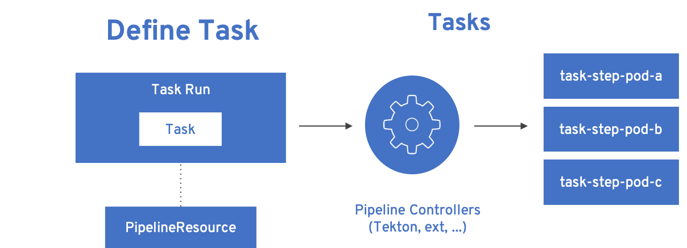
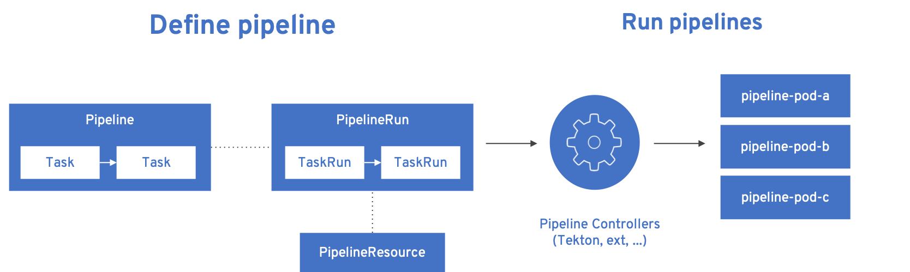

= Building Cloud Native Java Applications with Tekton

:coderay-linenums-mode: inline
:source-highlighter: coderay

Historically Java was able to handle the biggest enterprise problem(s) with its Write once,run anywhere(WORA) paradigm. With Cloud Native Applications grown to popularity, things like running applications as linux containers, serverless taking centre stage -- Java was pushed back by languages like golang, node.js as the forerunner to build Cloud Native Applications as they are smaller, quicker and arguably more nimble.

When analyzing what could be the possible reasons why developers were reluctant in building Kubernetes(Cloud) Native Java applications, I ended up the with the following possible reasons:

1. Java applications are slow to boot
2. What is the best way to build Java application container (a container here is the linux container that can run Java application) ?
3. The last point which is the subject of this article "pipelines" -- with traditional Java Enterprise world got used to pipelines via platform like Jenkins, Bamboo etc., which made them think what is the best way to do it for Cloud Native Java applications --

I am not going to over on first two points, as they are super easy by just using https://quarkus.io[Quarkus] and enterprise https://kubernetes.io[Kubernetes] distribution like https://openshift.com[OpenShift].

So what about pipelines ? But first question that comes to your mind is "Why cant I use the existing tools ?" Yes of course you can, but thinking about factors such as running it as containers, scale on demand and lastly fitting into the DevOps culture. 

The simple solution to these issues is using https://tekton.dev[Tekton]. Tekton was built keeping in mind:

- Containers - Built for container apps and runs on Kubernetes
- Serverless - Runs serverless with no CI/CD engine to manage and maintain
- DevOps - Designed with microserviecs and distributed teams in mind

[#install]
== Install Tekton Pipelines

=== Pre-req

- A https://kubernetes.io/docs/setup/learning-environment/minikube/[Kubernetes cluster] or try.openshift.com[OpenShift] with https://tekton.dev[Tekton] installed
- If minikube have the internal container registry deployed; check https://github.com/kameshsampath/minikube-helpers/tree/master/registry[Registry Helpers]
- Download and add https://github.com/tektoncd/cli[Tekton CLI] to the path

=== Demo Sources

For demonstrating the pipelines we will use a simple Java HelloWorld application built using https://quarkus.io[Quarkus], clone the demo sources locally:

[source,bash,linenums]
----
git clone https://https://github.com/kameshsampath/pipeline-helloworld && \
cd pipeline-helloworld && \
export DEMO_HOME=`pwd`
----

NOTE: For easier reference we will call the cloned git repository home as `$DEMO_HOME`

== Tekton Concepts

Before we start deploying our demo, it will be nice to know about the Kubernetes resources or objects that will defined using Tekton.

Everything in Tekton are defined using https://kubernetes.io/docs/concepts/extend-kubernetes/api-extension/custom-resources/Kubernetes[Custom Resources(CRD)]. With custom resources Tekton can define anything related to pipelines in Kubernetes Native way a.k.a Cloud Native way.

=== Pipeline resources

Defines referable resources such as source code repo, container images e.g. GitHub repository, container image url.

Defining the pipeline resources improves **reusability** by  making these resource parameters not local to task and pipelines. 

Lets explore pipeline resources defined as part of this https://github.com/kameshsampath/pipeline-helloworld[demo] 

.https://github.com/kameshsampath/pipeline-helloworld/blob/master/build-resources.yaml#L1-L11[GitHub source repo pipeline resource]

[source,yaml,linenums]
----
apiVersion: tekton.dev/v1alpha1
kind: PipelineResource
metadata:
  name: git-source <1>
spec:
  type: git <2>
  params: <3>
  - name: url
    value: https://github.com/kameshsampath/pipeline-helloworld
  - name: revision
    value: master
----
<1> Name of the pipeline resource, which will used to refer them in tasks and pipelines
<2> The type of the pipeline resource, in this case "git"
<3> The parameters for the resource. In this case url to the GitHub repository and the revision.

.https://github.com/kameshsampath/pipeline-helloworld/blob/master/build-resources.yaml#L13-L21[Container image pipeline resource]

[source,yaml,linenums]
----
apiVersion: tekton.dev/v1alpha1
kind: PipelineResource
metadata:
  name: helloworld-image <1>
spec:
  type: image <2>
  params: 
  - name: url
    value: "dev.local/example/helloworld" <3>
----
<1> Name of the pipeline resource, which will used to refer them in tasks and pipelines
<2> The type of the pipeline resource, in this case "image"
<3> The parameters for the resource. In this case container image url. This will be url where the container image will be built and pushed as part of the task and pipeline

There are few pipeline resource types that are defined during the install of the Tekton pipelines. Check https://github.com/tektoncd/pipeline/blob/master/docs/resources.md[here] for more details on available pipeline resources.

=== Tasks

A https://github.com/tektoncd/pipeline/blob/master/docs/tasks.md[Task] is the very fundamental unit of Tekton. Task consists of multiple atomic units called **step**. 

Step runs the command inside the container and it identical to the Kubernetes https://kubernetes.io/docs/concepts/workloads/pods/pod/[pod]. A task can have multiple steps, they get executed in the sequential order like how they were defined. 

Lets define the steps for our task to build a Java application container image from sources:

1. Build the Java application using build tools like Apache Maven or Gradle
2. Use the built artifacts to make the Java application container image
3. Push the built Java application container image to internal registry or external registry to allow platform like Kubernetes or OpenShift to consume them

Lets explore the demo Java build task,

.https://github.com/kameshsampath/pipeline-helloworld/blob/master/app-build-task.yaml[Java build app task]

[source,yaml,linenums]
----
apiVersion: tekton.dev/v1alpha1
kind: Task
metadata:
  name: build-app <1>
spec:
  inputs: <2>
   resources: <3>
    - name: source
      type: git
   params: <4>
   - name: contextDir
     description: Parameter Description
     default: .
   - name: mavenMirrorUrl
     description: Parameter Description
     default: http://repo1.maven.apache.org/maven2
   - name: destinationImage
     description: Parameter Description
     default: "${outputs.resources.builtImage.url}"
   - name: dockerFile
     description: Parameter Description
     default: src/main/docker/Dockerfile.jvm
  outputs: <5>
   resources:
    - name: builtImage
      type: image
  steps: <6>
   - name: build-sources
     image: quay.io/rhdevelopers/quarkus-java-builder:graal-19.1.1 <8>
     workingDir: "/workspace/source/${inputs.params.contextDir}"
     args:
      - '/usr/local/bin/maven-run.sh'
     env:
     - name: MAVEN_MIRROR_URL
       value: "${inputs.params.mavenMirrorUrl}"
     - name: MAVEN_CMD_ARGS
       value: "-DskipTests clean install"
     - name: WORK_DIR
       value: "/workspace/source/${inputs.params.contextDir}"
     resources:
       limits:
         cpu: 4
         memory: 4Gi
       requests:
         cpu: 2
         memory: 2Gi
     securityContext:
       privileged: true
   - name: build-image
     image: quay.io/buildah/stable
     workingDir: "/workspace/source/${inputs.params.contextDir}"
     command:
      - buildah
      - bud
      - --tls-verify=false
      - --layers
      - -t
      - "${inputs.params.destinationImage}"
      - -f 
      - "${inputs.params.dockerFile}"
      - .
     resources:
       limits:
         cpu: 4
         memory: 4Gi
       requests:
         cpu: 2
         memory: 2Gi
     securityContext:
       privileged: true
     volumeMounts:
     - name: varlibc
       mountPath: /var/lib/containers
   - name: build-push
     image: quay.io/buildah/stable
     workingDir: "/workspace/source/${inputs.params.contextDir}"
     command:
      - buildah
      - push
      - --tls-verify=false
      - "${inputs.params.destinationImage}"
      - "docker://${inputs.params.destinationImage}"
     securityContext:
       privileged: true
     volumeMounts:
     - name: varlibc
       mountPath: /var/lib/containers
  volumes:
  - name: varlibc
    emptyDir: {}      
----

<1> Name of the task, which will be used to refer to this task in other places such as task run, pipeline runs
<2> Each task has an optional input
<3> Input can have resources, typically the sources to build from. The task here defines a source of type to `Git` i.e. a GitHub source repository to clone sources
<4> Inputs can also have zero or more parameters that can be used in task steps
<5> Task can define an optional output, in our case this task will build a Java application container image from sources
<6> The steps actually define task's steps. In our case we have three steps namely:
 - `build-sources`: Runs a maven build to build the application sources
 - `build-image`: Runs a https://buildah.io[buildah] build to build the application container image from built java application artifacts
 - `build-image`: Pushes the built container image to internal or external container registry

The step follows the Kubernetes https://kubernetes.io/docs/reference/generated/kubernetes-api/v1.13/#pod-v1-core[pod specification] to define itself. This essentially means each step runs the command with in a **container**. The container image used in step container is called as `builder image`. 

All steps share a common directory called `workspace` that gets automatically mounted on all step containers of the task.

The task parameters could be referred/interpolated within the step specificaiton using the `${<name>}`. notation.

=== TaskRuns

https://github.com/tektoncd/pipeline/blob/master/docs/taskruns.md[TaskRun] allows to run an individual task. The task run allows us to pass the inputs(sources,parameters) and ouput references to the task. The references are usually defined via pipeline resources.

While defined the tasks we defined an  https://github.com/kameshsampath/pipeline-helloworld/blob/master/app-build-task.yaml#L8[input], https://github.com/kameshsampath/pipeline-helloworld/blob/master/app-build-task.yaml#L25[output] and bunch of https://github.com/kameshsampath/pipeline-helloworld/blob/master/app-build-task.yaml#L11-L22[parameters]. The names of these will act as an handle for us to pass the inputs/ouputs to the task from task run.

Lets see how we do it in the demo,

.https://github.com/kameshsampath/pipeline-helloworld/blob/master/app-build-task-run.yaml[Java build app task run]

[source,yaml,linenums]
----
apiVersion: tekton.dev/v1alpha1
kind: TaskRun
metadata:
  generateName: build-app- <1>
spec:
  serviceAccount: pipeline
  taskRef:
    name:  build-app <2>
  inputs:
   resources:
    - name: source <3>
      resourceRef: 
        name: git-source 
   params:
    - name: contextDir <4>
      value: app
    # Enable if you have maven mirrors to use
    # - name: mavenMirrorUrl
    #   value: http://nexus:8081/nexus/content/groups/public
  outputs:
   resources:
    - name: builtImage <5>
      resourceRef: 
        name: helloworld-image
----
<1> Since tasks can be run many times, its ideal to have unique names for each run. In his case each task run will have a name `build-app-<uuid>`
<2> `taskRef` is used to define the task that this task run will execute. In this case we use the task we defined earlier `build-app`
<3> Using the inputs -> resources, we link the task input resource named `source` with pipeline resource named `git-source`
<4> Set the task parameter named `contextDir` 
<5> Using the outputs -> resources, we link the task output resource named `builtImage` with pipeline resource named `helloworld-image`

== Deploy Demo

Having defined all the required resources that is needed to build the Java application, let us build and deploy the application on to Kubernetes. Before we go further its assumed that <<install,pipelines installation>> was done successfully.

=== Create a Service Account with cluster-admin privileges

[source,bash,linenums]
----
cd $DEMO_HOME &&\
kubectl create sa pipeline && \
kubectl create clusterrolebinding pipeline-cluster-admin-binding --clusterrole=cluster-admin --serviceaccount=default:pipeline
----

=== Create Pipeline Resources

[source,bash,linenums]
----
kubectl create -f build-resources.yaml
----

Since we have installed Tekton cli, we can verify the created resources using the command:

[source,bash,linenums]
----
tkn resources ls
----

TIP: You can also the short-name for the resources `res` e.g `tkn res ls`

The command above will return a list like

[source,bash,linenums]
----
NAME               TYPE    DETAILS
git-source         git     url: https://github.com/kameshsampath/pipeline-helloworld
helloworld-image   image   url: dev.local/example/helloworld
----

=== Create the build application task

[source,bash,linenums]
----
kubectl create -f app-build-task.yaml
----

We can verify the created task using the command:

[source,bash,linenums]
----
tkn task ls
----

The task list will show output like:

[source,bash,linenums]
----
NAME        AGE
build-app   2 hours ago
----

=== Trigger Task Run

[source,bash,linenums]
----
kubectl create -f app-build-task-run.yaml
----

We can verify the created taskrun using the command:

[source,bash,linenums]
----
tkn taskrun ls
----

TIP: You can also the short-name for the taskrun `tr` e.g `tkn tr ls`

The task list will show output like:

[source,bash,linenums]
----
NAME              STARTED       DURATION    STATUS
build-app-q2njj   2 hours ago   4 minutes   Succeeded
----

[NOTE]
==== 
Initially the task will take sometime as it may need to download all the images. The status above could be like `---` or `Pending` or `Running`. If something not done correctly it could be `Failed`

When a task run is failed you can use the command `kubectl describe taskrun <taskrun-name>` to see the reason of failure

You can check the logs of the task run using the command:

[source,bash]
----
tkn tr logs -f -a <taskrun-name>
----
====

[[#test-demo-app]]
=== Test built application

Once the task run is successful we can do a quick test deploying the application to Kubernetes,

[source,bash,linenums]
----
kubectl run helloworld --image=dev.local/example/helloworld --generator=deployment/apps.v1 <1>
kubectl expose deployment helloworld --port=8080 --target-port=8080 --type='NodePort' <2>
----
<1> Create a Kubernetes deployment of the built Java application
<2> Expose the deployment as a service

If you are using minikube then you can access the service using the command `curl "$(minikube service helloworld --url)/hello"`

== Pipelines

Task as very fundamental units of CI/CD, all we have seen until now is how to create, build and test your task(s). But task as themselves are not so interesting combining few tasks together. 

In the example above we had task to build and create linux container of Java application, but we have to manually deploy the application on to Kubernetes. Will that not be nice if we can have task that can do that manual deployment as well ? 

Exactly thats what "Pipelines" is used for. Pipelines allows you define a set of tasks to be executed in a defined order; with data flowing from one task to another seamlessly.

One of the biggest drawbacks of few existing and popular CI/CD tools is that they don't capabilities to extend and reuse tasks. But Tekton has built with the capability of of reuse; where you can use tasks from community and other places via https://github.com/tektoncd/catalog[catalog].

Before we build and run our first pipeline lets create a simple task that can deploy our application. In this example we will be using https://openshift.com[OpenShift] cli to deploy the Java application into Kubernetes.

=== Create Kubernetes deploy task

.https://github.com/kameshsampath/pipeline-helloworld/blob/master/openshift-client-task.yaml[OpenShift client task]

[source,yaml,subs="attributes+,+macros"]
----
apiVersion: tekton.dev/v1alpha1
kind: Task
metadata:
  name: openshift-client
spec:
  inputs:
    params:
      - name: ARGS
        description: The OpenShift CLI arguments to run
        default: help
  steps:
    - name: oc
      image: quay.io/openshift-pipeline/openshift-cli:latest
      command: ["/usr/local/bin/oc"]
      args:
        - "${inputs.params.ARGS}"
----

Lets create the pipeline by running the following command: 

[source,yaml,subs="attributes+,+macros"]
----
kubectl create -f openshift-client-task.yaml
----

Verify the created task via the command `tkn task ls`.

=== Create Pipeline using build and deploy tasks

The pipelines follow pretty much the same structure as Task, except that pipelines has collection of tasks instead of steps.

.https://github.com/kameshsampath/pipeline-helloworld/blob/master/app-deploy.yaml[Deploy Java application pipeline]

[source,yaml,subs="attributes+,+macros"]
----
apiVersion: tekton.dev/v1alpha1
kind: Pipeline
metadata:
  name: app-deploy
spec:
  resources: #<1>
  - name: app-source
    type: git
  - name: app-image
    type: image
  tasks: #<2>
   - name: build-java
     taskRef:
       name: build-app
     params:
      - name: contextDir
        value: app
     resources:
      inputs:
       - name: source
         resource: app-source
      outputs:
       - name: builtImage
         resource: app-image
   - name: deploy-app
     taskRef:
       name: openshift-client
     runAfter: #<3>
      - build-java
     params:
      - name: ARGS
        value: "run --image=dev.local/example/helloworld --image-pull-policy=Never --generator=deployment/apps.v1 helloworld" #<4>
----
<1> Like Task pipeline can also define parameters and resources.
<2> The list of tasks that need to run as part of the pipeline
<3> The pipeline tasks can be order when to run, in this case we make the rask to run only after build-java task is completed
<4> Deploying the built java linux container image using the same commands and options which we used in manual mode. In this case the command is provided via `openshift-client` task and all we need is to pass the command options and parameters

=== Create the deploy application pipeline

[source,bash,linenums]
----
kubectl create -f app-deploy.yaml
----

We can verify the created pipeline using the command:

[source,bash,linenums]
----
tkn pipeline ls
----

The pipeline list will show output like:

[source,bash,linenums]
----
NAME        AGE
app-deploy   2 hours ago
----

== Trigger pipeline run

With that we are all set to trigger the pipeline. Instead of creating an YAML, lets use the Tekton CLI to trigger the pipeline run:

[source,bash,linenums]
----
tkn pipeline start   --resource="app-source=git-source" --resource="app-image=helloworld-image" --serviceaccount='pipeline' app-deploy
----

Pipeline `start` starts a new pipeline run and we can associate the pipeline run with pipeline resources via the option `--resource`

[TIP]
====
You can run `tkn pipeline start --help` to see more options
====

We can verify the created pipeline run using the command:

[source,bash,linenums]
----
tkn pipelinerun ls
----

TIP: You can also the short-name for the pipeline run `pr` e.g `tkn pr ls`

The task list will show output like:

[source,bash,linenums]
----
NAME              STARTED       DURATION    STATUS
app-deploy-k2nsy   2 hours ago   4 minutes   Succeeded
----

[NOTE]
====
Initially the pipeline will take sometime as it may need to download all the images. The status above could be like `---` or `Pending` or `Running`. If something not done correctly it could be `Failed`

When a pipelinerun is failed you can use the command `kubectl describe pipelinerun <pipelinerun-name>` to see the reason of failure.

You can check the logs of the pipeline run using the command:

[source,bash]
----
tkn pr logs -f -a <pipelinerun-name>
----

====

Once the build is successful and if you are using minikube then you can access the service using the command `curl "$(minikube service helloworld --url)/hello"`

Thats it! I hope you have understood the basics of how to build and deploy your Java application on to Kubernetes using Tekton pipelines. 

== Resources and References

* Demo video https://youtu.be/q5P2V_YShjA[YouTube]

* Tekton community catalogs

** https://github.com/tektoncd/catalog[Tekton Pipelines Catalog]
** https://github.com/redhat-developer-demos/pipelines-catalog[Red Hat Developers Pipelines Catalog]
** https://github.com/openshift/pipelines-catalog[OpenShift Pipelines Catalog]
